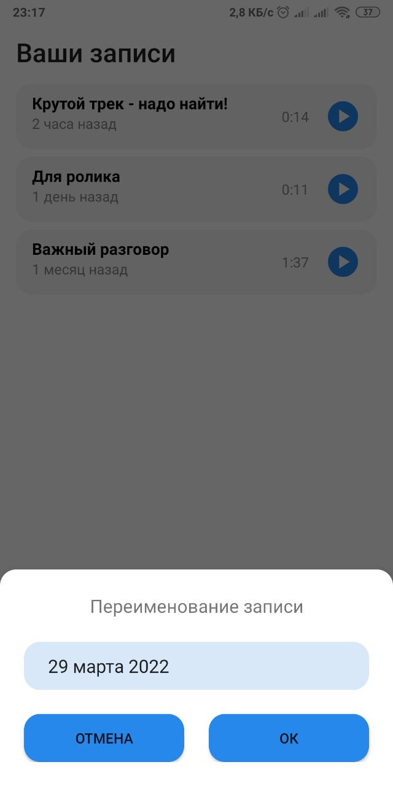

# Приложение для аудио-заметок Vk
Тестовое [задание](https://paper.dropbox.com/doc/.-2022-VK-SuperAppKit-Voice-d2s9YJEK30ROlNC8Ij6ay) на стажировку VK по вакансии стажёр в команду Android Voice

### Задачи
- [x] Реализовать приложение, в котором пользователь может записывать и вести историю своих голосовых-заметок. 
- [x] Авторизация через [VK SDK](https://github.com/VKCOM/vk-android-sdk) 
- [x] [Сохранение](https://vk.com/dev/docs.save) аудио-заметок в документы пользователя VK.
- [ ] [Распознование](https://www.tensorflow.org/) текста из аудио-заметок

### Preview

### Libraries

* View
    * [Material Components For Android](https://mvnrepository.com/artifact/com.google.android.material/material)
* Network
    * [OkHttp3](https://github.com/square/okhttp)   
* Other
    * [Kotlin Serialization](https://github.com/Kotlin/kotlinx.serialization)
    * [Prettytime](https://github.com/ocpsoft/prettytime)
    * [Core Android Extensions](https://github.com/tunjid/Android-Extensions/tree/develop/core) 
    * [ViewBindingPropertyDelegate](https://github.com/androidbroadcast/ViewBindingPropertyDelegate)
